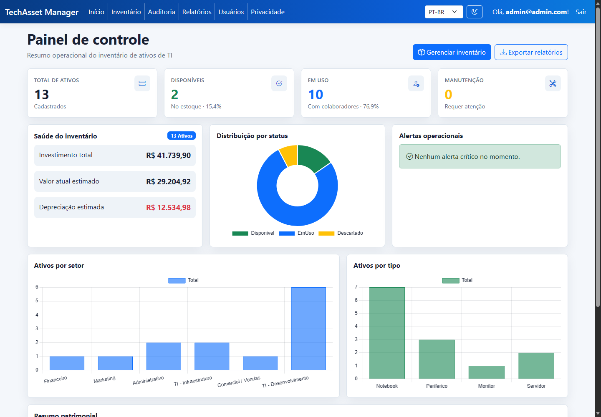
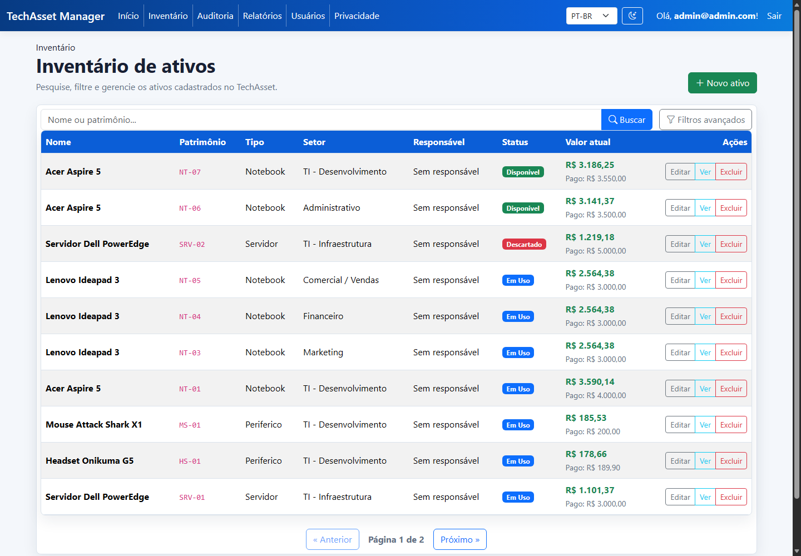
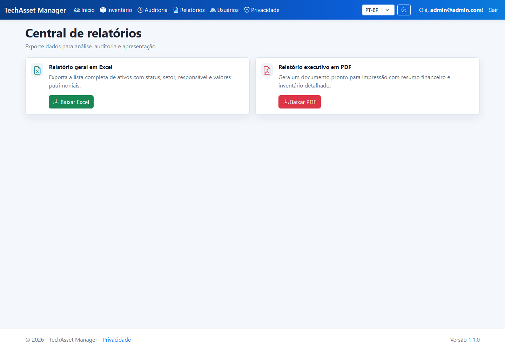
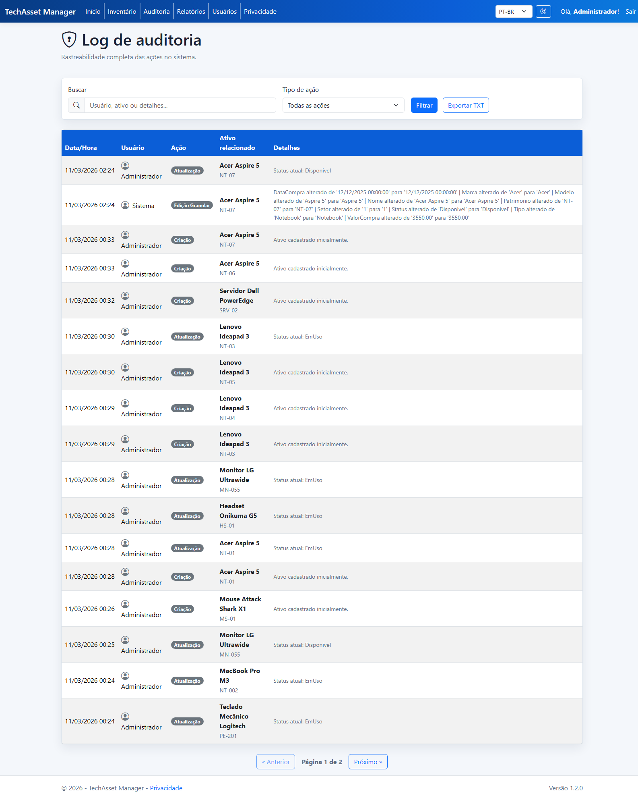
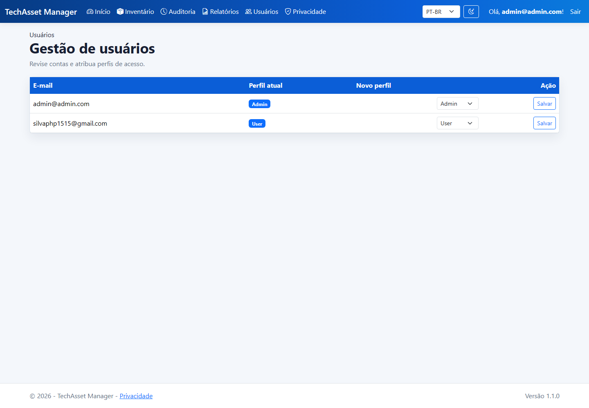
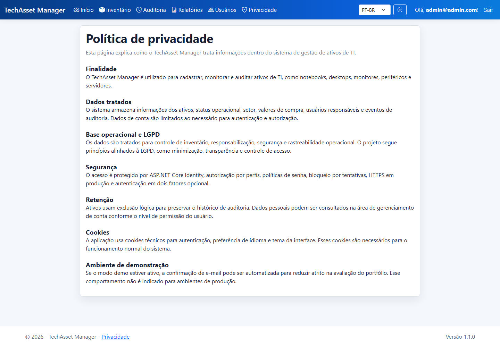

# TechAsset Manager

Sistema web para gerenciamento de inventário de ativos de TI, desenvolvido em ASP.NET Core MVC como projeto principal de portfólio. A aplicação cobre autenticação, autorização por perfis, rastreabilidade, cadastro de ativos, dashboard operacional, relatórios e deploy containerizado.

  

## Demo

A aplicação está disponível em produção:

https://techassetmanager.onrender.com/

Para avaliação técnica, este README apresenta stack, funcionalidades, decisões de arquitetura, segurança e screenshots reais do sistema.

### Como acessar a demo

A demo pública permite criação de conta para avaliação. No ambiente de demonstração, o cadastro é auto-confirmado para facilitar o teste do fluxo principal sem expor credenciais administrativas.

Após o cadastro, é possível acessar o dashboard, inventário, relatórios, auditoria e demais telas disponíveis ao perfil criado.

## Screenshots

### Dashboard



### Inventário



### Relatórios



### Auditoria



### Usuários



### Privacidade



## Problema

Empresas pequenas e médias frequentemente controlam notebooks, monitores, periféricos e servidores em planilhas descentralizadas. Isso dificulta saber onde cada item está, quem é o responsável, qual é o status operacional e qual é o valor patrimonial aproximado.

## Solução

O TechAsset Manager centraliza o cadastro de ativos, permite acompanhar status e setor, atribuir responsáveis, consultar histórico de movimentações e exportar relatórios. O projeto foi construído como uma aplicação MVC server-side para manter simplicidade operacional e boa aderência ao ecossistema .NET.

## Funcionalidades

- Dashboard responsivo com KPIs, gráficos por setor/status/tipo, alertas e resumo patrimonial.
- CRUD de ativos com validação via Data Annotations.
- Atribuição de ativos a usuários cadastrados.
- Auditoria de criação, edição, atribuição e exclusão lógica.
- Soft delete para preservar histórico.
- Busca, filtros combinados e paginação server-side.
- Exportação de relatório em Excel com ClosedXML.
- Exportação de relatório executivo em PDF com QuestPDF.
- Exportação do log de auditoria em TXT respeitando os filtros aplicados.
- Interface em PT-BR e EN-US com seletor persistido por cookie de cultura.
- Modo claro/escuro com preferência salva no navegador.
- Página de privacidade alinhada ao propósito do sistema e ao contexto LGPD.
- ASP.NET Core Identity com confirmação de e-mail, 2FA e lockout em falhas de login.
- RBAC com perfis `Admin`, `Manager` e `User`.
- Tela administrativa para alteração de perfis de usuários.
- Dockerfile e GitHub Actions para build, testes e auditoria de pacotes.

## Stack

- C# e ASP.NET Core MVC/Razor Pages
- ASP.NET Core Identity
- Entity Framework Core com migrations
- PostgreSQL via Npgsql
- Bootstrap 5, Bootstrap Icons, Razor Views e Chart.js
- ClosedXML para exportação Excel
- QuestPDF para exportação PDF
- xUnit para testes automatizados
- Docker e GitHub Actions

## Segurança

O projeto evita credenciais versionadas. Configure dados sensíveis por User Secrets no ambiente local ou variáveis de ambiente no deploy.

Variáveis esperadas:

```bash
DATABASE_URL=postgres://usuario:senha/host/banco
Smtp__User=seu-email-smtp
Smtp__Pass=sua-senha-ou-app-password
SEED_ADMIN_EMAIL=admin@exemplo.com
SEED_ADMIN_PASSWORD=uma-senha-forte
DEMO_MODE=false
```

Notas importantes:

- `DEMO_MODE=true` auto-confirma o e-mail no cadastro para facilitar demonstrações públicas. Use apenas em ambiente de demo.
- O seed de administrador só roda se `SEED_ADMIN_EMAIL` e `SEED_ADMIN_PASSWORD` estiverem configurados.
- O login aplica lockout após falhas, cookies HttpOnly/SameSite e headers básicos de segurança.
- Depois de qualquer segredo exposto, rotacione a credencial no provedor externo antes de publicar o repositório.

## Testes e Auditoria

```bash
dotnet test GerenciadorAtivosSolution.slnx
dotnet list GerenciadorAtivos/GerenciadorAtivos.csproj package --vulnerable --include-transitive
```

## Decisões Técnicas

- MVC server-side em vez de SPA para reduzir complexidade e destacar fundamentos de backend .NET.
- EF Core Code First para versionar evolução do schema.
- Identity padrão customizado em vez de autenticação própria.
- Soft delete para preservar rastreabilidade.
- Roles simples e explícitas para facilitar demonstração de autorização.
- Dashboard com consultas agregadas no banco para evitar carregar todo o inventário em memória.
- Internacionalização implementada por serviço de textos e cookie de cultura, mantendo PT-BR como padrão.

## Próximas Melhorias

- Criar uma API REST complementar para integração externa.
- Adicionar testes de controller/autorização com WebApplicationFactory.
- Adicionar logs estruturados e health checks.
- Criar uma demo em vídeo curto ou GIF mostrando login, dashboard, CRUD, atribuição, auditoria e exportação.
- Evoluir a tela de usuários para bloquear/desbloquear contas e resetar 2FA.

## Autor

Desenvolvido por Pedro Henrique como projeto de portfólio em desenvolvimento fullstack .NET.
